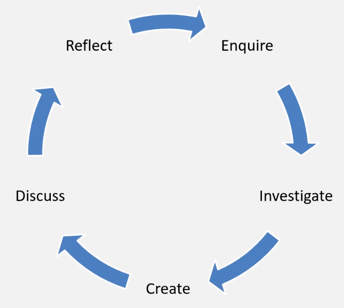
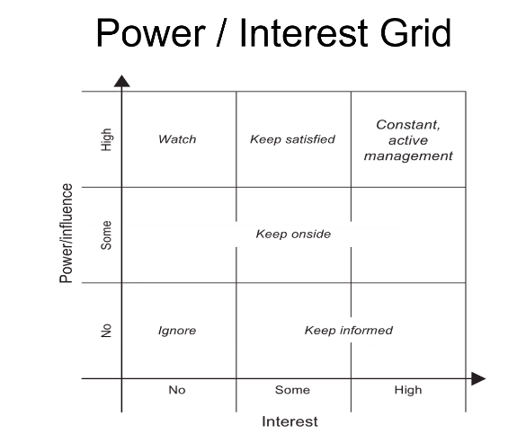

# Day 3
## Critical Thinking & Debating (15 QUESTIONS ON CRITICAL THINKING) 
### Objectives
- To understand what critical thinking is 
- To developed techniques for thinking, reading and writing critically
- To understand the formal structure 
- Some others

### Why is it important? 
- Helps you to create strong srguments by justrifying your claims with evidence you gathered and evaluated
- Can contribute to any role as it requires the ability to gather information, analyse it and evaluate it

### Critical Thinking Skills
- Actively seeing out all sides of an argument
- Checking the facts and evidence
- Responding objectively

### Level of intellectual Skill
Thinking triangle - Benjamin Blooms 

- `From top` Evaluate - Make judgements about the value of info
- Synthesise - Combine information or ideas into something new
- Analyse - Make a methodical and detailed examination of something
- Apply - Use knowledge
- Understand - Have understanding
- Remember - Be aware of something, recall information

(You want to use all of the steps of the triangle)

### 3 steps of the Critical Thinking Process

- Identify - identify the problem/main points of the argument, identify the claims being made, identify the evidence 
used and the conclusions reached. I.e. base your arguments on evidence that you gathered

- Analyse by asking the following: does the info make sense in relation to other research. How old is the material? Is the material
clear or do you need to find additional info to aid understanding. Does the argument present a balanced view or are some
topics disregarded. 

- Apply and compare, look out for: The implications of other information. Weaknesses when an applied to a real-life situation. 
A lack of coverage.

### 3 modes of thinking

- Divergent (Imagination) - questions lead to ideas
- Convergent (logic) - facts lead to answers
- Lateral - uses both - i.e. always do!!!!
 
e.g. use imagination to propose an idea, then use logic where you provide facts to solve a problem or answer a question
- Netflix lost database in 2009 as they had data in localhost (shutdown for 3 days, only time they were shutdown), decided to put 
all data on the cloud, took them a long time, but now they are extremely successful and saved a lot of money.
 
### 6 thinking hats again - IMPORTANT

- Developed as a parallel thinking process which enables people to redirect their thoughts into different areas i.e. hats
 Each represents a different factor or criteria of thinking
- White - Information needed
- Yellow - Brightness, optimism
- Black - Judgement, critical thinking
- Red - Emotions and feelings
- Green - Creativity, an opportunity to express new concepts etc.
- Blue - Thinking, its the control system that ensures all hats are utilised where needed

### Incorrect Attitudes
Neither of these ways of thinking are correct and will prevent you from embracing critical thinking with an open and objective mind

- Ignorant Certainty - The belief that there are definite answers to all questions e.g. overly optimistic person
- Naive Relativism - The beliefe that there is no truth and all agruments are equal e.g. Most of the time, there is a truth

### What is Enquiry-Based Learning?
Example. 17 in the class, after the class 1 came to trainer, he said that someone else was rude to me and dont put me in the same 
group as that person. Trainers job is to listen, take the info and calm him down, ask him "What happened? What did he say to you
to make you feel like that?" Once I have the info, I enquired about the incident, and decided to find out the other side of the
story. I haven't decided anything, I chose to enquire what happened instead of jumping to conclusions. Enquire enquire enquire, 
ask both what happened and the only way to truly find out what happened, you need to ask around to find out what happened. Assess
the situation before jumping to any conclusions.

- The Enquiry Cycle - Reflect - Enquire - Investigate - Create - Dicuss - Reflect - Enquire....

What questions might we ask when thinking critically? - e.g. What is the source of evidence?

Things to consider:
- What is the source of evidence? 
- What are the kinds of claims being made?
- Where is the evidence of these claims?
- What are the Strengths and Weaknesses?
- How clear are the points?
- Is it a balanced argument? 
- Are there underlying themes?
- Are the examples good? (Is the evidence good enough for me to take action)
- Are there difference or similarities to other situations?

Examples of graphs - Media exaggerates numbers to manipulate and MISLEAD people to make them think things are much worse 
than they actually are. LIES

3 different examples where the news MISLEADS people about statistics - CRITICALLY think about the data and decide whether it is true.

### Arguments and Debating

What is an argument?: - Difference of opinions

- Claim - Present your argument in a clear statement
- Evidence - Present the evidence to support your claim
- Impact - Explain the significance of the evidence i.e. how does it support your claim?

To form a judgement on the validity of another party's argument 

- Consider the following: 
-- Do the claims make logical sense? 
-- Are the claims based on opinion or supported with evidence?
-- Are any assumption made? 
-- Have all alternatives been considered?

Supporting evidence, consider the following:
- Does the evidence support all claims made?
- Is the evidence appopriate for the topic?
- Is the evidence recent?
- Does the evidence conflict or completent other evidence?
- Where does the evidence come from

`Quality of evidence = Quality of Data + Quality of Interpretation` 

### What if we want to challenge the argument?

Debating Etiquette
- Acknowledge the other person's view before challenging it
- Be constructive rather than simply dismissing the other peron's point of view
- Reflect on the strengths of the other person's argument
- Think about your language and whether you risk being offensive before you speak

Objective Phrasing

Do say
- It can be argued that
- Tends to
- There is evidence to suggest that...
- It has been said that....

Don't Say
- I...
- I think that...
- `MISSED SOME HERE`

### `All fallacies are on Discord` Logical Fallacies (Issues/Problems with the opposing sides arguments) to look for 

- False dichotomy - where the speaker forces the debate into two sides, though there are more options available
E.g. When a colleague tells the team to decide between two new HR tools but you have heard of a cheaper and more efficient 
tool online which you think would be more fit for purpose - Have they considered alternatives
- Assertion - When the speaker presents a statement as fact which appears invalid of may be an assumption
E.g. When a colleague states that because we doubled profits this year we will do so again next year? Do they know that for sure?
- Morally flawed - Arguments which go against the code of ethics and morals
- Correlation rather than causation - When a speaker suggests a link between two events suggesting one lead to the other but 
without sufficient evidence
- Failure to deliver promises - A speaker might fail to complete a task they promised to deliver
- Straw man - The speaker may intentionally introduce an argument against them and rebut it to strenghthen their position
- Contradiction - A speakers argument may contradict their previous argument and reduce their credibility.
E.g. When a colleague presents evidence showing only positive responses from a satisfaction survey but these contradict the 
complaints they previously showed
- Compare the conclusion to reality - Consider what would happen if the motion became reality, which usually reveals that 
its more complicated and problematic than the speaker suggested

### The Art of Persuasion (Small topic)

Three pillars of rhetoric:
- Ethos - Appealing thorugh authority or credibility (How well does the presenter show that he is credible and knowledgable about
the subject)
- Pathos - Appealing through emotional empathy (Use emotions) 
- Logos - Appealing through logic and reasoning (Use FACTS)
A combination of these 3 can be used depending on the situation 

BEING HUMBLE is an extremely beneficial attribute when persuading others
(Ads again - look at sample size e.g. 9 out of 10 dentists recommend when the sample size was 77)
(Ads - Bicycles picture utilising PATHOS or emotions to influence us and agree with them that they need more space on the road)
(Ads - Smoking kills - picture is very strong with the gun and cigs as bullets, so utilising emotions/facts too to influence you)

### Important Skills of Debating
- Keep points relevant
- Provide evidence and not personal opinion
- Remain objective
- Consider the audience's attention span
- Use notes but keep them brief and well organised

Do - BE LIKE OBAMA
- Be prepared
- Stay calm
- Speak clearly and confidently
- Keep your language simple 
- Active listening

Don't - BE LIKE TRUMP
- Falsify or alter evidence
- Publicly disagree wiith the decision
- Raise your voice or attack a speaker rather than the motion
- Act aggressively or offensively
- Interrupt others
- Disagree with facts or obvious truths

Remember...
- It's OK to make mistakes
- It's OK to agree

END OF CONTENT BEFORE LUNCH

# The Project Environments - Everything till Stakeholders 
- Understand the difference between BAU (Business as Usual) and Project work
- Have a clear understanding of a project life cycle and models 

### Project vs BAU.
Examples:
- Sparta Global BAU example (9am start training 5.30 end training - BAU, it this doesnt change its business as usual).
- Sparta Global Project example (Java, C#, Testing, Automated Tested, DevSecOps, DevOps - Project, specific things that are
happening, what else is happening).

BAU is the normal execution of a standard operations within an organisation

Project is unique and transient with a desired outcome

- BAU - organisational strategy

### ALL MODELS ON DISCORD AS PICS

- Project Cycle...
1. Initiation
2. Planning
3. Executing - (Working everyday at the academy)
4. Monitoring & Controlling - (Being monitored and tested)
5. Closing and back to..
1. Initiation

- Triple Constraint triangle (SCOPE relies on TIME, QUALITY AND COST)
1. Time (Done quickly? = lower quality and may cost more)
2. Quality
3. Cost

- POPIT model aka. Holistic Triangle
1. Organisation
2. Technology
3. Process
4. People
The key aspect connecting us all is... Technology = look at picture

Benefits of a project being managed well?
- Delivery is efficient
- Standard of content is higher
- Predict costs, time and quality of the project more accurately
- People involved will be less stressed and will generally be more happy

## Software Development Lifecycles
The project lifecycle encompasses all the activies of the project

Examples of Methodologies:
- Waterfall
- V-model
- Agile

Choosing methodology depends on the project and it can often be the case that a company may change methodologies when working
so it is important to understand them all

### Waterfall - (Attach picture)

1. System Requirements
2. Software Requirements
3. Analysis
4. Program Design
5. Coding
6. Testing
7. Operations

From 7. Operations you can go back to 4. Program Design
From 4. Program design can go back to 2. System requirements and then follow the water fall again

Disadvantages
- Takes a long time and when you decide that something is not good enough it is difficult to go back REALISTICALLY
- Can't test between 

### V-Model 
Works in V shape, go left to right

1. Requirement specification
2. Functional Specification
3. Technical Specification
4. Program Specfication
5. Coding
6. Unit Testing
7. Integration Testing - Is OS compatible, ports! Which ports will it work
8. System Testing - Similar to integration, does it work on each OS 
9. Acceptance Testing - Is it ready to go

### Agile (Iterative)
Cycle, constant entry and exit

Enter
1. Plan (Design)
2. Do (Code)
3. Check (Test)
Exit - If improvements needed, go again

### Scrum FRAMEWORK (TRELLO?) - INTERVIEWS! Difference between SCRUM and Agile etc. 

1. Product Backlog
2. Sprint Planning
3. Sprint Backlog
4. Daily SCRUM, cycle between the spring and backlog (e.g. Trello, week sprint, then done and cycle between them)
Technically, we are currently using an Agile methodology as well as SCRUM to do work with Trello

Agile is a methodology (used in a development environment) SCRUM is NOT a methodology it is a FRAMEWORK to manage the 
methodology. Essentially as above, SCRUM is using Trello to manage our work, it is very useful to make sure that tasks
get done.

### Management Plans and SDLCs
Software Development Lifecycles

All stages are a PROJECT LIFECYCLE:

- Stage 1 - Initiating, Start of Planning 
- Stage 2 - Planning
- Stage 3 - Start of the development cycle i.e. planning, executing, monitoring and controlling
- Stage 4 - Same as Stage 3, finishing the lifecycle
- Stage 5 - Closing

### What is DevOps? Sparta video - WATCH IT AGAIN AS ITS VERY GOOD FOR INTERVIEWS ETC, SHOULD BE ON TEAMS
Developer responsible for new product features, bug fixes etc etc.
Once products are done you need to deploy them into production

Operations teams are responsible for managing services/servers and that everything is working correctly

At the moment development and operations are working separately and blame eachother for issues within development or delivery

DevOps is breaking this up and have the two teams work together, share responsibilites, automate pipeline and deploying infrastructure
as code. Improves lifecycle of product - more money for the companies

These practices are
- Continous integration - local to cloud (git)
- Continous deployment - 
- Continous Delivery - Work with cloud, Ci/Cd, jenkins, git etc is continous delivery to check for differences 

Benefits of DevOps:
- Faster time to market the product
- Continous release cycles
- Improved collaboration between teams
- Automated coding

### Notes on organisations, roles and general
Many teams within one company, different departments e.g. sales, operations, talent etc.

Attributes of mature teams
- Co-located
- Cross-functional roles (DevOps - understand both the development and the operations environment) 
- Self-organising
- Accountable and empowered
- Test and learn feedback loops (Our Friday Tests)

Every organisation pretty much has
- BA - Business Analysts
- QA - Quality Assurance
- UX - Front-end
- DEV - Developers
- PM - Project Managers

Projects are difficult
- Create a POSITIVE atmosphere
- Manage conflict INTELLIGENTLY
- Have open and clear COMMUNICATION
- RESPECT all of your peers
- Become TRUSTWORTHY

## Essential Project Knowledge
### Business Cases
In order to get a project going, you need many things:
- Justification for the proposed project needed to obtain authorisation from the Board

1. Expected benefits/disadvantaged
2. Execution timeline - When do you get a return on your investement
3. Executive Summary
4. Investement appraisal
5. Solutions/Options
6. Major risks
7. Stakeholders/communication plan

Examples of basic techniques for analysis - Good techniques to build a business case
- MOST
- Boston Box
- PESTLE
- SWOT - Strengths, Weaknesses, Opportunities
- Workshops
- Interviews
- Questionnaires

This also includes the initiation of requirement gathering:
- An essential part of your academy development
Your stakeholders are important

### Return on Investment (ROI)
How much money will you make from your investment into a project? When will we get it? 
- It all comes down to the worth of the product to the people who need it
- Once you have paid off all the investments and started to make profit, that is a return of investment

### Risk
What is Risk? Why is it so important to identify risk early in any project?

Sources of risk:
- Techology
- Team
- Scope
- Business
- Economy
- Competition

Dealing with Risk
- Avoidance
- Transfer
- Reduce
- Accept
- Exploit
- Share
- Enhance
- Ignore

### Stakeholders
- Customers
- Partners
- Suppliers
- Regulators
- Employees
- Managers
- Owners
- Competitors

Power/Interest Grid 

- Best case scenario - have powerful stakeholders who are deeply interested in the project

Stakeholder Attitudes
- Champions - fight for the cause of the project
- Supporters - support the project and speak favourably
- Neutral - Ok if it works its fine, if it doesnt then whatever
- Critic - Negative, needs to be forced onto the positive side
- Opponent - dont want you to do the project
- Blocker - v negative

