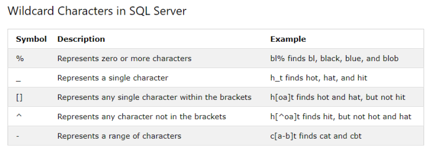
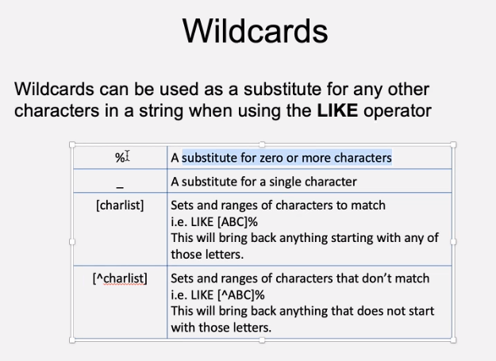
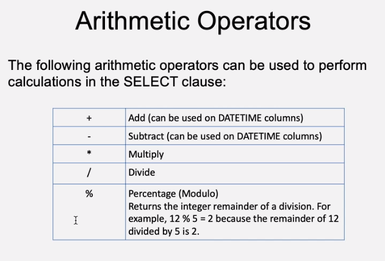
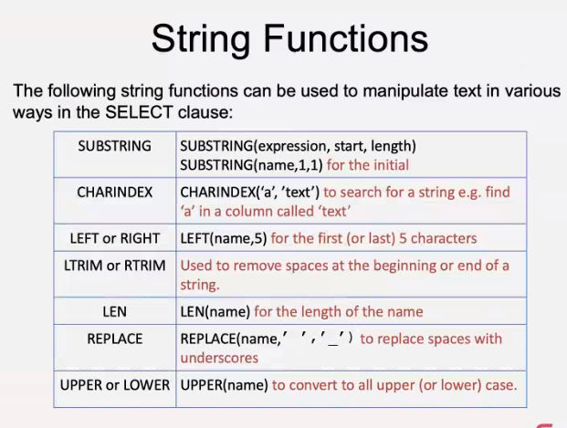

# Day 2 - Querying an SQL Database
## Objectives
- Demonstrate the ability to connect to a database and query it
- Write simple SQL statements to alter and add data
- Write simple queries to extract and compare data
- Demonstrate an ability to research and learn technical skills independently

## SELECT


**Logical Syntax Sequence**
- SELECT 
- DISTINCT
- FROM 
- WHERE
- GROUP BY
- HAVING
- ORDER BY

**Processing Sequence**
- FROM
- WHERE
- GROUP BY
- HAVING
- SELECT
- DISTINCT
- ORDER BY

```sql
SELECT * FROM Customers
```
- An Asterisk * means to select all columns
i.e. SELECT all columns FROM the table

### WHERE
We can better define what we want with the WHERE clause
- WHERE is used to filter the data 

**Example from Northwind database**
```sql
SELECT ContactName, Fax, CompanyName, City FROM Customers WHERE City = 'London';
```

- City is the column
- The = symbol is the operator
- 'London' is the comparator

To create a valid WHERE clause you need to make sure each data type you request is formatted properly APOSTROPHES!!!!


### DISTINCT
**`SELECT DISTINCT` if you want to remove duplicates from data. The more columns you select, the less likely you are to need DISTINCT**
```sql
SELECT DISTINCT Country FROM Customers WHERE ContactTitle = 'Owner'
```

### COUNT
**To count the number of all rows in the constraint, type `COUNT(*)` as shown below**

```sql
SELECT COUNT(*) FROM Customers WHERE Country = 'France';
SELECT COUNT(CompanyName) FROM Customers WHERE Country = 'France'
```

### TOP
**Can select only the top number of values as shown below:

```sql
SELECT TOP 100 CompanyName, City FROM Customers WHERE City = 'Paris'
```

### AND
**AND keyword is a powerful tool as seen below - it forces it follow both rules**
```sql
SELECT ProductName, UnitPrice FROM Products WHERE CategoryID = 1 AND Discontinued = '0'
```
### OR
**Can use OR to get out info when either side are true**

### Other operators
- '<>' Or != not equal to
- '<' Less than
- '>' More than
- '<=' Less than or equal to
- '>=' Greater than or equal to
These work with numbers, but do they work with letters?

### Wildcards & LIKE
Wildcards can be used as a substitute for any other characters in a string when using the LIKE operator





- LIKE allows for the use of wildcards and is not case sensitive

**We can use the wildcard % to bring back any Products that begins with Ch:**
```sql
SELECT ProductName FROM Products WHERE ProductName LIKE 'Ch%'
```

**If we needed to find regions ending in A:**
```sql
SELECT * FROM Customers WHERE Region LIKE '_A'
```

**If we needed to find customers in two specific named regions:**
```sql
SELECT * FROM Customers WHERE Region IN ('WA', 'SP')
```

**If we need to find territories in a range of IDs:**
```sql
SELECT * FROM EmployeeTerritories WHERE TerritoryID BETWEEN 06800 AND 09999
```

**Concatenate using + along with single quotes, essentially can edit the names of the columns to nice names:**
- Alias (rename) column using AS (optional) and double quotes (if more than one word) to change column headers
- In this example we concatenate to and from a comma and a space, e.g. "London, UK" in one resulting column
```sql
SELECT CompanyName AS 'Company Name', City + ',' + Country AS 'City' FROM Customers
```

**In order to filter based on NULLs simply use IS NULL or IS NOT NULL:**
```sql
SELECT CompanyName AS 'Company Name', City + ',' + Country AS 'City' FROM Customers WHERE Region IS NULL
```

## Arithmetic Operators
**Table below shows the operators that can be used in the SELECT clause**




```sql
SELECT UnitPrice, Quantity, Discount, UnitPrice * Quantity AS 'Gross Total' FROM [Order Details];
```

```sql
SELECT UnitPrice, Quantity, Discount, UnitPrice * Quantity AS 'Gross Total' FROM [Order Details] ORDER BY 'Gross Total' DESC
```
DESC is short for descending 
ASC is short for ascending 

## String Functions 




