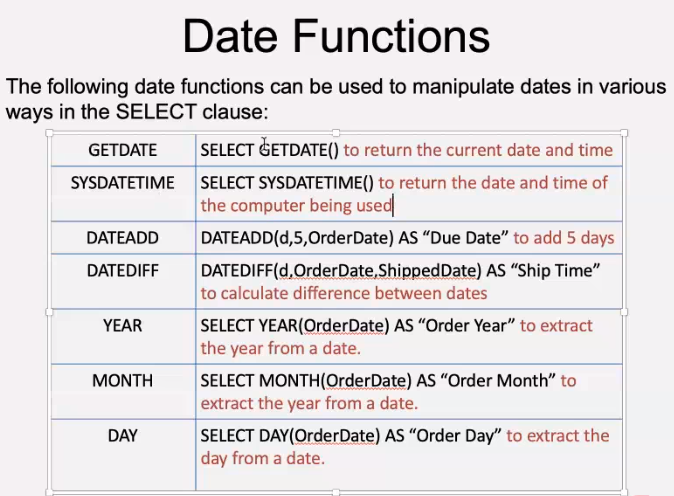

# Day 3 - JOINS
## Date Functions



**Find the age of employees by examining their birthdates**
```sql
SELECT FirstName + ' ' + LastName AS 'Name', 
DATEDIFF(yy, BirthDate, GETDATE()) AS 'Age in Years'
FROM Employees
```
### Poor Man's IF statements - IMPORTANT
**CASE statements can be useful when you need varying results output based on differing data. Pay close attention to WHEN THEN ELSE
and END. Use single quotes for data and double quotes for column aliases.**
```sql
SELECT CASE
WHEN DATEDIFF(d, OrderDate, ShippedDate) < 10 THEN 'On Time'
ELSE 'Overdue'
END AS 'Status'
FROM Orders
```

**Editing the above code to include retirement age*
```sql
SELECT FirstName + ' ' + LastName AS 'Name', 
DATEDIFF(yy, BirthDate, GETDATE()) AS 'Age in Years',
CASE
    WHEN DATEDIFF(yy, BirthDate, GETDATE()) >= 65 THEN 'Retired'
    WHEN DATEDIFF(yy, BirthDate, GETDATE()) > 60 THEN 'Retirement Due'
    WHEN DATEDIFF(yy, BirthDate, GETDATE()) < 60 THEN 'More than 5 years to go'
    ELSE 'Retirement in 5 years'
END AS 'Retirement details'
FROM Employees
```

## Aggregate Function


- Just functions, very similar to Python

**GROUP BY is added to provide subtotals. The total, average etc calculated for each Supplier for example. Notice we have added 
SupplierID in to the SELECT to help identify each total output. Multiple columns can be added as a comma separated list to
provide further levels of subtotals. This essentially assigns each SupplierID with their relevant subtotals**
```sql
SELECT SupplierID,
    SUM(UnitsOnOrder) AS 'Total on Order',
    AVG(UnitsOnOrder) AS 'Avg on Order',
    MAX(UnitsOnOrder) AS 'Max on Order'
FROM Products 
GROUP BY SupplierID
```

**HAVING is used instead of WHERE when filtering on subtotals/grouped data. Column aliases cannot be used in the HAVING clause.
Aggregate functions are not available for use in the WHERE clause due to the SQL processing sequence.**
```sql
SELECT SupplierID,
    SUM(UnitsOnOrder) AS 'Total on Order',
    AVG(UnitsOnOrder) AS 'Avg on Order'
FROM Products
GROUP BY SupplierID
HAVING AVG(UnitsOnOrder) > 5;
```

# JOINS
## Objectives
- Understand the various JOIN types available within SQL
- Determine the differences between JOIN types using SET theory
- Discover the power of the simple subquery

## Definition
JOIN is an SQL keyword used to combine matched rows from two or more tables. It allows you to create a list of combined rows of
matching data from different tables. 


